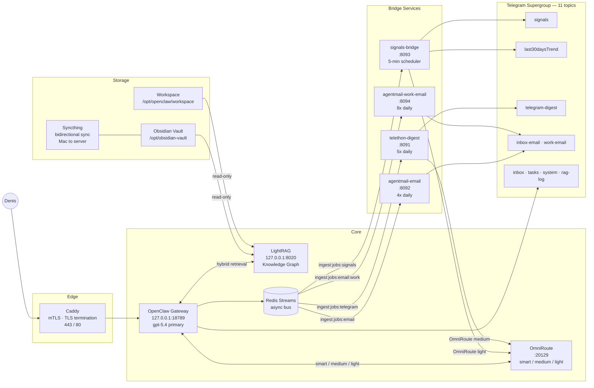
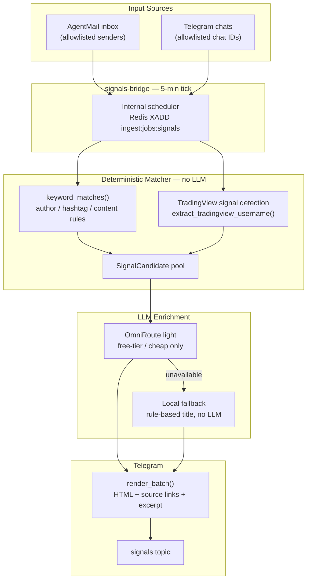
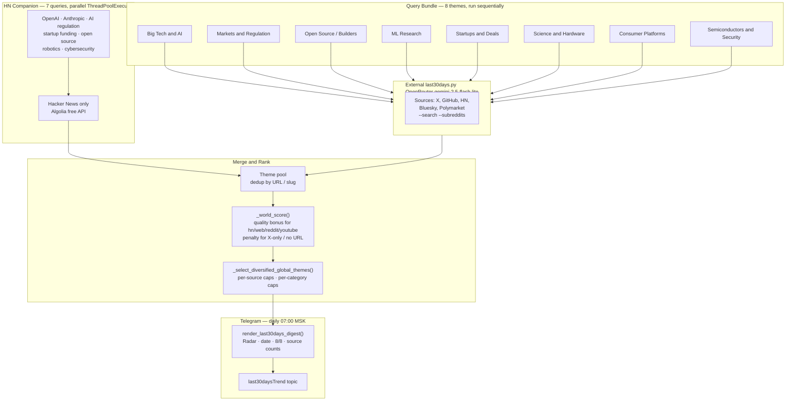
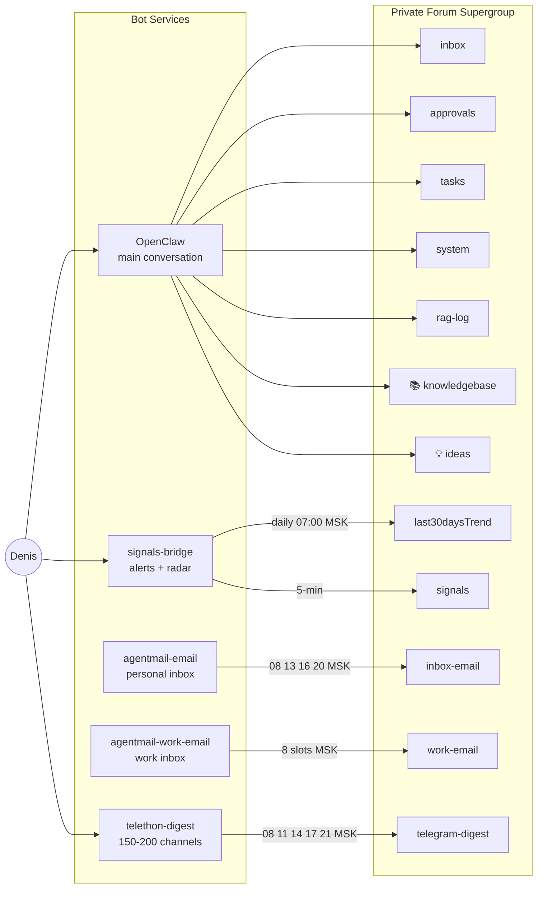

# clawden-ai

> Personal AI ops platform — self-hosted, event-driven, always-on.

[](LICENSE)
[](https://python.org)
[](https://docker.com)
[](https://github.com/coollabsio/openclaw)
[](https://telegram.org)

**Бенька** — a 24/7 personal AI assistant running on a private Hetzner server. Reads your Telegram channels, email, and signals. Routes every request to the right model. Remembers context across sessions in a knowledge graph.

This repository is the **ops & config package**: deployment runbooks, workspace templates, redacted config artifacts, and bridge service source code. Not the OpenClaw source tree itself.

---

## Overview

Most personal AI setups are chatbots — you open a window, type a question, get an answer, close it. **clawden-ai** works the other way around: the system runs continuously in the background and pushes information to you before you ask.

At its core is **OpenClaw**, a self-hosted AI gateway running on a private Hetzner server. It brokers every request through **OmniRoute** — a three-tier model dispatcher that picks the right LLM for the job (expensive reasoning model for complex tasks, fast cheap model for classification, local fallback for everything else). Long-term memory lives in **LightRAG**, a knowledge graph that combines vector search with graph traversal, fed continuously from an Obsidian vault synced between the Mac and the server.

Four **bridge services** run on cron-like schedules and handle the event-driven part:

- **signals-bridge** watches email and Telegram for market signals, runs deterministic rule matching, and enriches matches with a lightweight LLM call before posting to the `signals` topic.
- **signals-bridge / Last30Days** now supports two presets: `personal-feed` for our focused daily radar and `platform-pulse` for platform-by-platform storylines. The current scheduled run posts the personal feed to the `last30daysTrend` topic.
- **telethon-digest** reads 150–200 Telegram channels through a user session, clusters and summarizes with a medium-tier model, and posts a daily digest.
- **agentmail-email / work-email** poll two inboxes on a schedule and route notable messages to the right topic; the work inbox digest resolves the original sender inside forwarded emails and renders explicit actionable vs informational triage.

Everything is observable through a Telegram supergroup with 11 dedicated topics — effectively a personal feed that aggregates across all pipelines.

---

## Features

**Always-on assistant**
- Responds to messages in Telegram 24/7 via a private bot with full tool access (shell, filesystem, browser, web search, subagents)
- Routes every request to the right LLM tier automatically — expensive model for complex tasks, cheap model for background work
- Remembers context across sessions through a knowledge graph backed by your Obsidian notes

**Signals & market radar**
- Watches email inboxes and Telegram chats for rule-matching signals (trading alerts, market events) — deterministic prefilter, LLM only on hits
- Daily **World Radar** digest: 8 broad topic queries + 7 HN-optimized companion queries run in parallel, deduplicated, ranked by source quality, posted as a structured digest to Telegram
- Source coverage: X/Twitter, HackerNews, GitHub trending, Reddit, Bluesky, Polymarket

**Telegram channel digest**
- Reads 150–200 Telegram channels through a personal Telethon session (not a bot — full channel access)
- Clusters and summarizes with a medium-tier model, posts 5× daily

**Email digests**
- Polls two inboxes (personal + work) on a schedule, threads notable messages, and posts structured recaps to dedicated Telegram topics; `work-email` additionally splits the window into actionable vs informational triage

**Knowledge graph memory**
- LightRAG indexes curated wiki pages plus raw signal digests using graph + vector hybrid retrieval
- Vault syncs bidirectionally between Mac and server via Syncthing — write a note on Mac, it's searchable on the server within minutes
- **`📚 Knowledgebase` topic**: write any question → bot searches across Obsidian wiki + workspace + signals, opens top refs, and answers in a grounded expanded format with citations plus source links when provenance exists; forward any post or link → bot auto-extracts title/domain/summary and saves it into `wiki/research/**` first, then enqueues the touched wiki pages into LightRAG
- **`💡 Ideas` topic**: forward anything (posts, links, thoughts) → bot auto-captures into `wiki/research/**` with lighter curation; promotion later enriches the same artifact chain instead of creating it from scratch

**Self-hosted, private**
- Runs entirely on a single private Hetzner server — no SaaS, no data sent to third parties beyond the LLM API calls you configure
- All external access goes through Caddy with TLS + mTLS client certificate authentication
- Secrets never leave the server; this repo contains only sanitized config artifacts and runbooks

---

## How It Works

Everything runs inside Docker containers on a single Hetzner CX23 (3 vCPU / 4 GB RAM, Ubuntu 24.04). Caddy is the only public-facing service — it terminates TLS and enforces mTLS client certificate auth before anything reaches OpenClaw. All other services communicate over the private `openclaw_default` Docker bridge network.

```
┌─────────────────────────────────────────────────────────────────────────┐
│  Hetzner CX23 (3 vCPU / 4 GB RAM, Ubuntu 24.04)                        │
│                                                                         │
│  ┌──────────────────────────────────────────────┐                      │
│  │  Caddy (reverse proxy)                       │ ← 443 / 80           │
│  │  TLS termination + mTLS client cert auth     │                      │
│  └──────────────────┬───────────────────────────┘                      │
│                     │ 127.0.0.1:18789                                  │
│  ┌──────────────────▼───────────────────────────┐                      │
│  │  openclaw-gateway  (Docker)                  │                      │
│  │                                              │──→ OpenAI gpt-5.4    │
│  │  tools: shell · fs · web · browser           │    (primary, OAuth)  │
│  │         subagents · sessions · cron          │                      │
│  │  volume: /opt/openclaw/config/  → state      │──→ omniroute:20129   │
│  │          /opt/openclaw/workspace/ → bot      │    (smart/med/light) │
│  │          /opt/obsidian-vault/ → vault        │                      │
│  └──────────────────┬───────────────────────────┘                      │
│                     │ Docker network (openclaw_default)                │
│  ┌──────────────────▼──────────────────────────────────────────────┐  │
│  │  OmniRoute  (Docker)                                            │  │
│  │  127.0.0.1:20128 (dashboard)  ·  127.0.0.1:20129 (API)         │  │
│  │                                                                  │  │
│  │  smart  → Kiro/Claude Sonnet → OpenRouter/Claude → OR/Kimi      │  │
│  │  medium → Kiro/Claude Haiku  → Gemini Flash → OpenRouter/Qwen3  │  │
│  │  light  → Kiro/Claude Haiku → Gemini Flash → OpenRouter/Qwen3   │  │
│  └──────────────────┬───────────────────────────────────────────────┘  │
│                     │                                                   │
│  ┌──────────────────▼───────────────────────────┐                      │
│  │  LightRAG  (Docker)   127.0.0.1:8020         │                      │
│  │  LLM: OmniRoute light                        │                      │
│  │  Embedding: gemini-embedding-001 (dim=3072)  │                      │
│  │  Storage: NetworkX · NanoVectorDB · JsonKV   │                      │
│  │  inputs: workspace/ + obsidian/ (read-only)  │                      │
│  └──────────────────────────────────────────────┘                      │
│                                                                         │
│  ┌──────────────────────────────────────────────┐                      │
│  │  integration-bus-redis  (Docker)             │                      │
│  │  Redis 7 Streams — async integration bus     │                      │
│  │  streams: ingest:jobs:* · ingest:events:*    │                      │
│  │           ingest:rag:queue · dlq:failed       │                      │
│  └──────────────────┬───────────────────────────┘                      │
│                     │                                                   │
│  ┌──────────────────▼───────────────────────────┐                      │
│  │  signals-bridge  (Docker)   :8093            │                      │
│  │  scheduler every 5 min → email + Telegram    │                      │
│  │  deterministic prefilter → OmniRoute light   │                      │
│  │  → signals topic  (+ daily Last30Days radar) │                      │
│  └──────────────────────────────────────────────┘                      │
│  ┌──────────────────────────────────────────────┐                      │
│  │  telethon-digest  (Docker)   :8091           │                      │
│  │  150–200 Telegram channels via MTProto       │                      │
│  │  → OmniRoute medium → telegram-digest topic  │                      │
│  │  schedule: 08/11/14/17/21 Moscow             │                      │
│  └──────────────────────────────────────────────┘                      │
│  ┌──────────────────────────────────────────────┐                      │
│  │  agentmail-email-bridge  (Docker)   :8092    │                      │
│  │  agentmail-work-email    (Docker)   :8094    │                      │
│  │  IMAP poll → thread snapshots → LLM         │                      │
│  │  → inbox-email / work-email topics           │                      │
│  └──────────────────────────────────────────────┘                      │
│                                                                         │
│  /opt/obsidian-vault/ ← Syncthing bidirectional sync with Mac          │
└─────────────────────────────────────────────────────────────────────────┘
```

### Request Path (interactive)

When Denis sends a message to the Telegram bot:

1. **Caddy** terminates TLS and forwards to OpenClaw over mTLS
2. **OpenClaw** classifies intent and picks a routing tier
3. **OmniRoute** selects the best available model (smart → medium → light, with provider failover)
4. If context is needed, **LightRAG** runs a hybrid vector + graph query over the Obsidian vault
5. Response streams back through Caddy to Telegram

### Event Pipeline (background)

Bridge services run on independent schedules, triggered via **Redis Streams**:

1. Scheduler fires → XADD to `ingest:jobs:*` stream
2. Bridge consumer picks up the job, polls the source (email IMAP, Telegram MTProto, web search)
3. Results enriched via OmniRoute (light or medium tier) and formatted for Telegram
4. Bridge posts to the target topic; events land in `ingest:events:*` for downstream consumption

### Memory & Context

The Obsidian vault is the long-term memory store. Notes sync bidirectionally between Mac and server via Syncthing. A bot-maintained `wiki/` holds curated pages, while `raw/signals/` stores daily signal snapshots. Retrieval is intentionally split by profile: OpenClaw builtin `memorySearch` covers fast local recall over curated memory files plus `wiki/`, while LightRAG indexes the broader curated layer (`workspace`, `wiki/`, `raw/signals/`) for deeper historical lookups. Raw vault sources such as `raw/articles/` and `raw/documents/` stay out of both retrieval layers until curated import materializes them into visible wiki pages. For explicit user saves, the wiki page is the proof of storage; LightRAG indexing is secondary.

The shortest mental model is:

```text
raw sources -> curated wiki -> LightRAG index -> OpenClaw answers
```

In other words: `wiki/` is the durable source of truth, `LightRAG` is the retrieval layer on top of it, and explicit saves are only considered complete once they create a visible wiki artifact.

If you want the shortest human explanation of why this exists and how the memory cycle works, start
with [docs/19-llm-wiki-memory-explained.md](docs/19-llm-wiki-memory-explained.md). If you are
another LLM/agent trying to understand this repo fast, use
[docs/20-llm-project-orientation.md](docs/20-llm-project-orientation.md).

Recommended memory reading path:
- human: `README -> docs/19 -> docs/10 -> docs/17 -> docs/15`
- LLM/agent: `docs/20 -> docs/19 -> docs/10 -> docs/15 -> docs/17`

---

## Table of Contents

- [Overview](#overview)
- [How It Works](#how-it-works)
- [Architecture](#architecture)
- [Services](#services)
- [Data Flow](#data-flow)
  - [Signals Pipeline](#signals-pipeline)
  - [Last30Days Presets](#last30days-presets)
- [Telegram Surfaces](#telegram-surfaces)
- [Model Routing](#model-routing)
- [Source Coverage](#source-coverage)
- [Memory System](#memory-system)
- [Repository Structure](#repository-structure)
- [Quick Operations](#quick-operations)
- [Getting Started](#getting-started)
- [Security](#security)
- [Docs](#docs)
- [License](#license)

---

## Architecture

One private server. Eight Docker containers. Everything connected through Redis Streams.



**Host:** Hetzner CX23 · 3 vCPU / 4 GB RAM · Ubuntu 24.04  
**Network:** All services on `openclaw_default` Docker bridge. Only Caddy is public-facing (ports 80/443).

---

## Services

| Service | Role | Network binding | LLM tier |
|---------|------|----------------|----------|
| **OpenClaw Gateway** | Main agent runtime, conversation broker | `127.0.0.1:18789` | gpt-5.4 (OAuth Plus) |
| **OmniRoute** | Smart model dispatcher, 3-tier routing with failover | `127.0.0.1:20128` (UI), `:20129` (API) | — |
| **LightRAG** | Knowledge graph, hybrid vector+graph retrieval | `127.0.0.1:8020` | OmniRoute `light` + Gemini embeddings |
| **wiki-import** | Curated import bridge for `url` / `text` / `server_path` into LLM-Wiki | `127.0.0.1:8095` | deterministic v1 |
| **Redis Streams** | Async integration bus, consumer groups, DLQ | internal only | — |
| **signals-bridge** | Signal routing from email + Telegram sources | `127.0.0.1:8093` | OmniRoute `light` |
| **telethon-digest** | Telegram channel digest (150–200 channels) | `127.0.0.1:8091` | OmniRoute `medium` |
| **agentmail-email** | Personal inbox polling + scheduled digests | `127.0.0.1:8092` | OmniRoute `medium` |
| **agentmail-work-email** | Work inbox polling + scheduled digests with forwarded-sender resolution and actionable/info triage | `127.0.0.1:8094` | OmniRoute `medium` |

---

## Data Flow

### Signals Pipeline

Low-latency path from email and Telegram sources to the `signals` topic.
Deterministic matching runs first — LLM is only called for enrichment when a rule fires.



### Last30Days Presets

`signals-bridge` now supports two daily digest modes:

- `personal-feed` — query-driven radar for our focused themes; this is the direct successor to the old `world-radar`
- `platform-pulse` — platform-first brief showing what Reddit / Hacker News / X / Bluesky are talking about, with English story titles plus direct links

Compatibility note: `world-radar-v1` still works as an alias to `personal-feed-v1`.

The current scheduled run remains `personal-feed` at 07:00 MSK. It combines 8 thematic queries with a parallel HN companion pass — 7 short Algolia-friendly queries run concurrently against Hacker News to surface high-quality stories that long composite query strings miss.



**Source priority:** `hn → web → reddit → youtube → bluesky → github → polymarket → x`  
**Per-source caps:** `hn:5, web:5, reddit:5, youtube:4, bluesky:3, github:4, polymarket:2, x:2`

---

## Telegram Surfaces



| Surface | Posted by | Cadence | Purpose |
|---------|-----------|---------|---------|
| `inbox` | OpenClaw | on demand | ops dialogue, commands |
| `approvals` | OpenClaw | on demand | human confirmation for sensitive actions |
| `tasks` | OpenClaw | on demand | task lifecycle, progress |
| `system` | OpenClaw | on demand | deploy notes, health, incidents |
| `rag-log` | OpenClaw | on demand | memory/RAG observability |
| `telegram-digest` | telethon-digest | 5× daily | curated channel digest |
| `inbox-email` | agentmail-email | 4× daily | personal inbox recap |
| `work-email` | agentmail-work-email | 8× daily | work inbox recap with original sender resolution plus actionable/info triage |
| `last30daysTrend` | signals-bridge | daily 07:00 MSK | Personal Feed — top 10 themes |
| `signals` | signals-bridge | 5-min | actionable alerts from email + Telegram |
| `knowledgebase` | OpenClaw | on demand | question → LightRAG hybrid search + grounded expanded answer with citations/source links; content → bot auto-structures + wiki ingest |
| `ideas` | OpenClaw | on demand | frictionless capture — any forwarded post/link/thought → light-curated `wiki/research/**`; promotion later deepens curation |

---

## Model Routing

OmniRoute dispatches tasks across three tiers with automatic provider failover.

| Tier | Use case | Provider chain |
|------|----------|---------------|
| **smart** | Code review, architecture, long context (>8K) | Kiro/Claude Sonnet → OpenRouter/Claude 3.5 → OpenRouter/Kimi K2 |
| **medium** | Summarization, Q&A, digests | Kiro/Claude Haiku → Gemini 2.0 Flash → OpenRouter/Qwen3-30B |
| **light** | Classification, signals enrichment, tagging | Kiro/Claude Haiku → Gemini 2.0 Flash → OpenRouter/Qwen3-8B |

**Primary model:** OpenAI gpt-5.4 via OAuth Plus — main OpenClaw conversation, not routed through OmniRoute.
**LightRAG:** OmniRoute `light` for LLM extraction/summarization, direct Gemini `gemini-embedding-001` for embeddings.
**Last30Days reasoning:** OpenRouter `google/gemini-2.5-flash-lite` via `OPENROUTER_API_KEY` in `signals.env`.

| Provider | Auth | Cost |
|----------|------|------|
| **Kiro** | AWS Builder ID OAuth | Free, unlimited |
| **OpenRouter** | API key hub | Pay-per-token; free models available |
| **Gemini** | API key | Free tier (1500 req/day) |
| **OpenAI** | Plus OAuth via OpenClaw | Existing Plus subscription |

---

## Source Coverage

Status of data sources for the active Last30Days presets:

| Source | Status | Requires |
|--------|--------|---------|
| Hacker News | ✅ Active | Free (Algolia API) |
| GitHub | ✅ Active | `GITHUB_TOKEN` |
| X / Twitter | ✅ Active | `CT0` cookie |
| Bluesky | ⚠ 0 results | `BSKY_HANDLE` + `BSKY_APP_PASSWORD` (auth ok, search returns empty) |
| Reddit | ✅ Active | Free native hybrid (`old.reddit.com` JSON + RSS) plus optional `platform_sources.reddit.feeds`; optional `SCRAPECREATORS_API_KEY` tertiary backup |
| YouTube | ⏸ Frozen | `SCRAPECREATORS_API_KEY` (paid); yt-dlp blocked by YouTube bot-check without cookies |

YouTube is architecturally supported — `lib/youtube_yt.py` with yt-dlp fallback path exists in the external script. Disabled pending cost decision.

## Reddit Hybrid Path

`signals-bridge` now runs Reddit through a free native adapter that is patched into the pinned
`last30days-skill` during image build. The runtime path is:

1. `old.reddit.com/search.json` for global search
2. `old.reddit.com/r/<subreddit>/search.json` for configured subreddit-first discovery
3. native RSS fallback:
   - `search.rss`
   - subreddit `search.rss`
   - thread `comments.rss`
4. `SCRAPECREATORS_API_KEY` only if configured as an optional tertiary backup

Why `curl` matters: on this server, Python `urllib`/`requests` gets blocked by Reddit on the JSON
path, while `curl` succeeds. The adapter therefore uses `curl` subprocess calls as the canonical
transport for Reddit endpoints.

### Recommended subreddit seeds

For `personal-feed-v1`, the live config now uses this curated baseline:

```json
"platform_sources": {
  "search": "x,reddit,youtube,hackernews,github,bluesky,polymarket",
  "reddit": {
    "feeds": [
      "worldnews",
      "technology",
      "science",
      "Futurology",
      "economics",
      "geopolitics",
      "artificial",
      "MachineLearning",
      "OutOfTheLoop"
    ]
  }
}
```

This mix is intentionally broad:
- `worldnews`, `geopolitics`, `economics` catch macro, regulation, elections, trade
- `technology`, `science`, `Futurology`, `artificial`, `MachineLearning` catch AI and frontier tech
- `OutOfTheLoop` helps with internet-culture and controversy spikes

Tune this list sparingly. The goal is not maximum volume; it is better recall on recurring
high-signal communities without drowning the digest in subreddit-specific noise.

### What the adapter preserves

- Same normalized Reddit item shape for downstream ranking and rendering
- Real `score` and `num_comments` when JSON search succeeds
- Best-effort `top_comments` from `comments.rss`
- `metadata.retrieval_transport` for diagnostics (`json`, `rss`, `scrapecreators`)
- Non-fatal behavior when comment enrichment fails

### Operational verification

Healthy Reddit runs show up in `GET /status` under:

- `last30days.source_counts.reddit`
- `last30days.errors_by_source.reddit` absent or empty

Example of a successful live run on `2026-04-14`:

```json
{
  "preset_id": "world-radar-v1",
  "source_counts": {
    "reddit": 43,
    "x": 31
  },
  "errors_by_source": {}
}
```

---

## Memory System

Three trust layers — never conflate them:

```
LIVE    — docker ps / curl / logs        highest trust, current state only
RAW     — workspace/raw/YYYY-MM-DD-*.md  verbatim decisions, redacted before commit
DERIVED — MEMORY.md, daily notes         quick recall, not canonical
```

**LLM-Wiki** lives under `/opt/obsidian-vault/wiki/` with system files:
- `CANONICALS.yaml` — canonical slugs, aliases, themes
- `SCHEMA.md` — write rules
- `TOPICS.md` — thematic navigator
- `OVERVIEW.md` — cold-start summary
- `INDEX.md` — full catalog
- `IMPORT-QUEUE.md` — curated import state
- `LOG.md` — append-only operations

**LightRAG** indexes only `/opt/openclaw/workspace/`, `/opt/obsidian-vault/wiki/`, and `/opt/obsidian-vault/raw/signals/` every 30 minutes via `lightrag-ingest.sh`. Hybrid vector + graph retrieval. OpenClaw queries it at `http://lightrag:9621/query` (internal) or `http://127.0.0.1:8020/query` (host).

**Curated import** goes through the internal `wiki-import` bridge. `raw/articles/` and `raw/documents/` are stored in the vault but stay out of LightRAG until curated import materializes them into visible wiki pages, assigns themes, and rebuilds `TOPICS.md`. Explicit saves always create `wiki/research/**` first; only after that does LightRAG enqueue the touched wiki pages.

See [`docs/10-memory-architecture.md`](docs/10-memory-architecture.md) for the full design.

---

## Repository Structure

```
.
├── artifacts/
│   ├── openclaw/               OpenClaw config templates (secrets as <placeholders>)
│   ├── omniroute/              OmniRoute compose + env templates
│   ├── integration-bus/        Redis Streams compose
│   ├── agentmail-email/        Personal inbox bridge — source + Dockerfile + tests
│   ├── telethon-digest/        Telegram channel digest bridge — source + Dockerfile
│   ├── signals-bridge/         Signals + Last30Days presets — source + Dockerfile
│       ├── last30days_runner.py    8 queries + HN companion + diversified ranking
│       ├── poster.py               Telegram HTML renderer (radar format)
│       ├── last30days_patches/     Build-time upstream patches (Reddit hybrid adapter)
│       ├── config.example.json     platform_sources + query_bundle
│       └── tests/                  71 unit tests
│   ├── wiki-import/            Curated import bridge for LLM-Wiki
│   └── llm-wiki/               Wiki scaffold, schema, templates
├── docs/
│   ├── 01-server-state.md          Current snapshot: services, ports, images, env
│   ├── 02-openclaw-installation.md Deployment decisions, auth setup
│   ├── 03-operations.md            Full ops runbook
│   ├── 06-command-log.md           Command history with context
│   ├── 07-architecture-and-security.md  Security model + signals architecture
│   ├── 08-git-and-redaction-policy.md   Git safety, secret handling
│   ├── 09-workspace-setup.md       Bot personalisation guide
│   ├── 10-memory-architecture.md   Three-layer memory design
│   ├── 11-lightrag-setup.md        LightRAG deployment + ingestion
│   ├── 12-telegram-channel-architecture.md  Telegram topology, permissions
│   ├── 13-ai-assistant-architecture.md      Model routing, assistant behavior
│   └── 14-codex-skills.md          Project skill catalog
├── scripts/
│   ├── deploy-workspace.sh
│   ├── deploy-signals-bridge.sh
│   ├── deploy-wiki-import.sh
│   ├── deploy-telethon-digest.sh
│   ├── deploy-agentmail-email.sh
│   ├── deploy-agentmail-work-email.sh
│   ├── deploy-llm-wiki.sh
│   ├── setup-llm-wiki.sh
│   └── lightrag-ingest.sh
├── skills/
│   └── openclaw-cron-maintenance/  Cron-store maintenance runbook skill
├── workspace/                      Bot workspace (deployed to /opt/openclaw/workspace)
│   ├── IDENTITY.md                 Бенька persona
│   ├── AGENTS.md                   Session protocol, memory rules, boot sequence
│   ├── BOOT.md                     8-step startup checklist
│   ├── TOOLS.md                    Tool reference + lightrag_query
│   ├── TELEGRAM_POLICY.md          Telegram runtime policy
│   └── HEARTBEAT.md                Periodic maintenance tasks
├── CHANGELOG.md
├── CLAUDE.md                       Claude Code agent instructions
└── LOCAL_ACCESS.md                 ← gitignored — real credentials
```

**Gitignored:** `LOCAL_ACCESS.md`, `secrets/`, `scripts/lightrag.env`, `workspace/USER.md`, `workspace/MEMORY.md`, `workspace/SOUL.md`, `workspace/memory/[0-9]*.md`

---

## Quick Operations

```bash
export OPENCLAW_HOST="deploy@<server-host>"

# Deploy workspace changes
./scripts/deploy-workspace.sh

# Deploy bridge services
./scripts/deploy-signals-bridge.sh
./scripts/deploy-wiki-import.sh
./scripts/bootstrap-llm-wiki.sh
./scripts/deploy-telethon-digest.sh
./scripts/deploy-agentmail-email.sh
./scripts/deploy-agentmail-work-email.sh

# Safe LLM-Wiki cutover helpers
./scripts/deploy-llm-wiki.sh
./scripts/setup-llm-wiki.sh

# Health checks
ssh -i ~/.ssh/id_rsa "$OPENCLAW_HOST" 'curl -sf http://127.0.0.1:18789/healthz'
ssh -i ~/.ssh/id_rsa "$OPENCLAW_HOST" 'curl -sf http://127.0.0.1:8020/health | python3 -m json.tool'
ssh -i ~/.ssh/id_rsa "$OPENCLAW_HOST" 'curl -s http://127.0.0.1:8093/health'
ssh -i ~/.ssh/id_rsa "$OPENCLAW_HOST" 'curl -s http://127.0.0.1:8094/health | python3 -m json.tool'

# OmniRoute dashboard (SSH tunnel)
ssh -i ~/.ssh/id_rsa -L 20128:127.0.0.1:20128 "$OPENCLAW_HOST" -N &
# open http://localhost:20128

# Trigger Last30Days Personal Feed manually
ssh -i ~/.ssh/id_rsa "$OPENCLAW_HOST" \
  'curl -s -X POST http://127.0.0.1:8093/trigger \
    -H "Authorization: Bearer <SIGNALS_BRIDGE_TOKEN>" \
    -H "Content-Type: application/json" \
    -d "{\"job_type\": \"last30days_daily\", \"preset_id\": \"personal-feed-v1\"}"'

# Redis Streams status
ssh -i ~/.ssh/id_rsa "$OPENCLAW_HOST" \
  'docker exec integration-bus-redis redis-cli XLEN ingest:jobs:signals'
ssh -i ~/.ssh/id_rsa "$OPENCLAW_HOST" \
  'docker exec integration-bus-redis redis-cli XLEN dlq:failed'

# Trigger LightRAG re-index
ssh -i ~/.ssh/id_rsa "$OPENCLAW_HOST" '/opt/lightrag/scripts/lightrag-ingest.sh'
```

See [`docs/03-operations.md`](docs/03-operations.md) for the full runbook.

---

## Getting Started

1. Read the docs in order — see [Docs](#docs) below
2. Copy artifact templates from `artifacts/openclaw/` and fill in your values
3. Create gitignored files locally:
   - `LOCAL_ACCESS.md` — SSH host, Telegram token, API keys, cert paths
   - `secrets/` — mTLS client certificates
   - `scripts/lightrag.env` — Gemini API key
   - `workspace/USER.md`, `workspace/MEMORY.md`, `workspace/SOUL.md`
4. Deploy workspace: `./scripts/deploy-workspace.sh`
5. Deploy bridges as needed (each has its own deploy script)
6. Provision LightRAG (first time): `./scripts/setup-lightrag.sh`
7. Set up Obsidian sync: install Syncthing on Mac and follow [`docs/03-operations.md`](docs/03-operations.md)

---

## Security

- **Caddy + mTLS** — client certificate required for all external access; HSTS 1 year
- **UFW** — only ports `22`, `80`, `443` open; all internal services bound to `127.0.0.1`
- **OpenClaw tools** — `profile=coding`, `exec=deny/ask-always`; no host shell from gateway
- **No secrets in git** — all tracked files use `<placeholder>` syntax; real values in gitignored `secrets/` and `LOCAL_ACCESS.md`

See [`docs/07-architecture-and-security.md`](docs/07-architecture-and-security.md) and [`docs/08-git-and-redaction-policy.md`](docs/08-git-and-redaction-policy.md).

---

## Docs

| # | File | What it covers |
|---|------|---------------|
| 01 | [server-state](docs/01-server-state.md) | Current snapshot: services, ports, images, env |
| 02 | [openclaw-installation](docs/02-openclaw-installation.md) | Deployment decisions, auth setup, image derivation |
| 03 | [operations](docs/03-operations.md) | Full ops runbook: SSH, health checks, troubleshooting |
| 06 | [command-log](docs/06-command-log.md) | Full command history with decision context |
| 07 | [architecture-and-security](docs/07-architecture-and-security.md) | Security model: mTLS, UFW, tool profile, signals architecture |
| 08 | [git-and-redaction-policy](docs/08-git-and-redaction-policy.md) | Git safety, secret handling, redaction patterns |
| 09 | [workspace-setup](docs/09-workspace-setup.md) | Bot personalisation guide |
| 10 | [memory-architecture](docs/10-memory-architecture.md) | Three-layer memory: live / raw / derived |
| 11 | [lightrag-setup](docs/11-lightrag-setup.md) | LightRAG deployment and ingestion guide |
| 12 | [telegram-channel-architecture](docs/12-telegram-channel-architecture.md) | Telegram topology, permissions, RAG gates |
| 13 | [ai-assistant-architecture](docs/13-ai-assistant-architecture.md) | Model routing, assistant behavior, approval boundaries |
| 14 | [codex-skills](docs/14-codex-skills.md) | Project skill catalog for recurring Codex workflows |
| 15 | [llm-wiki-query-flow](docs/15-llm-wiki-query-flow.md) | End-to-end LLM-Wiki flow: curated import, LightRAG retrieval, OpenClaw answer assembly |
| 16 | [llm-wiki-storage-model](docs/16-llm-wiki-storage-model.md) | Reference-only storage rules: slugs, themes, topic maps, archive placement |
| 17 | [knowledge-management](docs/17-knowledge-management.md) | Knowledgebase and Ideas workflow: save, capture, promotion |
| 19 | [llm-wiki-memory-explained](docs/19-llm-wiki-memory-explained.md) | Human-first explanation of `raw -> wiki -> LightRAG -> OpenClaw` |
| 20 | [llm-project-orientation](docs/20-llm-project-orientation.md) | LLM-facing project map: read order, trust hierarchy, doc routing |

---

## License

MIT
