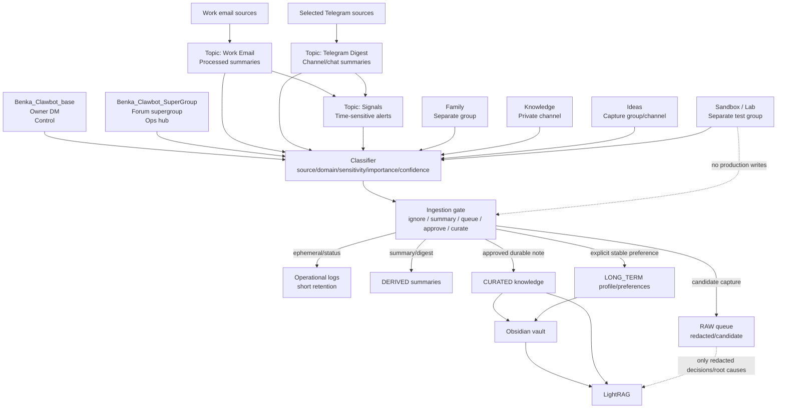

# Telegram Channel Architecture

This document defines the Telegram topology, permissions model, context modes, memory policy, and
RAG ingestion gates for Benka / Бенька.

The design goal is not "the bot reads everything." The design goal is controlled human interface,
clean operational channels, conservative memory, and a path from noisy inputs to curated knowledge.

---

## Part 1 - Telegram Topology

### Recommended Final Structure

| Surface | Practical recommendation | Type | Role | Used by | Bot behavior | Category |
|---|---|---|---|---|---|---|
| `Benka_Clawbot_base` | Keep as the primary DM | DM | Most privileged owner control channel | Denis only | Responds directly, can ask approvals, can create tasks, can propose memory writes. Does not silently execute destructive/sensitive actions. | Control |
| `Benka_Clawbot_SuperGroup` | Keep as a private forum supergroup with topics | Supergroup/forum | Operational control hub | Denis, optionally trusted operators later | Handles approvals, task status, alerts, system logs, RAG logs. Reads only operational topics by policy. | Control / publish |
| `Inbox Email` | Topic in the supergroup for personal AgentMail inbox | Topic | Scheduled personal email recap surface | Denis | Posts scheduled digests only. Internal 5-minute polling is service-side and not posted to Telegram. Does not publish raw full emails. | Publish / derived ingestion |
| `Work Email` | Keep as a reserved topic in the supergroup; split into private channel if volume grows | Topic | Future processed work email summaries and triage | Denis | Reserved for a future standalone work-email pipeline. When enabled, it should post summaries/actionable triage only and never raw full emails by default. | Publish / derived ingestion |
| `Telegram Digest` | Start as a topic in the supergroup; split into private channel if it becomes noisy | Topic | Summaries from selected Telegram sources | Denis | Posts daily/periodic digests only. Source chats are separate allowlisted inputs, not the digest surface itself. | Publish |
| `Signals` | Topic in the supergroup, optionally mirrored to DM for critical items | Topic | Time-sensitive alerts from email and Telegram | Denis | Speaks proactively only for high-importance, time-sensitive signals. Can pin critical alerts if allowed. | Alert / publish |
| `Family` | Fully separate private group/supergroup, not a topic in ops | Separate group | Family domain and personal/family context | Family members and Denis | Conservative: by default requires mention or reply. Does not read the whole stream unless explicitly enabled for a narrow period. | Ingestion / family |
| `Knowledge` | Standalone private channel plus Obsidian as canonical destination | Private channel | Finalized structured knowledge items, decisions, durable notes | Denis, bot | Posts only structured/curated items. Content is eligible for Obsidian and RAG after schema checks. | Knowledge |
| `Ideas` | Separate private group/channel owned by Denis | Private group or channel | Fast capture of thoughts, links, raw ideas | Denis | Captures, lightly classifies, tags, and queues for later promotion. Not automatically long-term knowledge. | Capture |
| `Sandbox / Lab` | Fully separate private group | Sandbox group | Testing prompts, Telegram behavior, tools, integrations | Denis, bot | Free to experiment. No production memory writes. May use wider permissions inside this isolated surface. | Testing |

### Topic Layout For `Benka_Clawbot_SuperGroup`

Use a single operational forum supergroup with these topics:

| Topic | Purpose | Memory behavior |
|---|---|---|
| `inbox` | General operational commands and intake | Session-only unless a decision is made |
| `approvals` | Human confirmation for sensitive/destructive actions | Store approval outcome, not full sensitive payload |
| `tasks` | Task lifecycle, status, retries | Operational log; compact summaries only |
| `alerts` / `signals` | Important time-sensitive notifications | Derived alert summary; short retention |
| `system` | Deploys, restarts, health, incidents | Operational log; promote root causes to raw if meaningful |
| `rag-log` | RAG ingestion decisions and failures | Operational log; no raw content unless curated |
| `inbox-email` | Personal inbox scheduled digests | Summaries only; no raw email bodies by default |
| `work-email` | Reserved topic for future work-email summaries | Summaries only; no raw email bodies by default |
| `telegram-digest` | Digest output from selected channels/chats | Digest summaries only |

### Merge / Split Recommendations

Start with fewer Telegram surfaces, but keep the domain boundaries explicit:

- Keep `Work Email`, `Telegram Digest`, and `Signals` as topics inside
  `Benka_Clawbot_SuperGroup` at first. They are operational outputs, not social spaces.
- Keep `Family` separate from the supergroup. Family context must not mix with work, ops, or RAG logs.
- Keep `Knowledge` separate. It is the clean gate into Obsidian/RAG, not a noisy discussion channel.
- Keep `Ideas` separate if it will receive many quick links and fragments. It should feel frictionless
  without polluting knowledge memory.
- Keep `Sandbox / Lab` separate because test permissions and prompts should never bleed into production.

---

## Part 2 - Permissions Table For Telegram UI

Legend:

- `ALLOW` - recommended permission or behavior
- `DENY` - should not be granted
- `OPTIONAL` - allow only if the workflow needs it
- `N/A` - not applicable to this Telegram surface

| Surface | Read messages | Post messages | Reply | Pin | Delete | Manage topics | Invite users | Full admin | Require mention to activate | Read whole stream by default | Safe for auto-ingestion into memory | Needs confirmation before action |
|---|---|---:|---:|---:|---:|---:|---:|---:|---:|---:|---:|---:|
| `Benka_Clawbot_base` | ALLOW | ALLOW | ALLOW | N/A | N/A | N/A | N/A | N/A | N/A | ALLOW | DENY | ALLOW |
| `Benka_Clawbot_SuperGroup` | ALLOW | ALLOW | ALLOW | OPTIONAL | DENY | OPTIONAL | DENY | DENY | OPTIONAL | OPTIONAL | DENY | ALLOW |
| `Inbox Email` | DENY | ALLOW | OPTIONAL | DENY | DENY | N/A | DENY | DENY | N/A | DENY | DENY | ALLOW |
| `Work Email` | DENY | ALLOW | OPTIONAL | DENY | DENY | N/A | DENY | DENY | N/A | DENY | DENY | ALLOW |
| `Telegram Digest` | DENY | ALLOW | OPTIONAL | DENY | DENY | N/A | DENY | DENY | N/A | DENY | DENY | OPTIONAL |
| `Signals` | DENY | ALLOW | ALLOW | OPTIONAL | DENY | N/A | DENY | DENY | N/A | DENY | DENY | ALLOW |
| `Family` | OPTIONAL | ALLOW | ALLOW | DENY | DENY | DENY | DENY | DENY | ALLOW | DENY | DENY | ALLOW |
| `Knowledge` | ALLOW | ALLOW | OPTIONAL | OPTIONAL | DENY | N/A | DENY | DENY | N/A | ALLOW | OPTIONAL | OPTIONAL |
| `Ideas` | ALLOW | ALLOW | ALLOW | DENY | DENY | N/A | DENY | DENY | OPTIONAL | OPTIONAL | OPTIONAL | OPTIONAL |
| `Sandbox / Lab` | ALLOW | ALLOW | ALLOW | OPTIONAL | OPTIONAL | OPTIONAL | DENY | DENY | OPTIONAL | OPTIONAL | DENY | ALLOW |

### Permission Notes

- `Benka_Clawbot_base` is privileged because the user is privileged, not because the bot gets
  unlimited autonomy. Memory writes and sensitive operations still use explicit gates.
- `Benka_Clawbot_SuperGroup` can run mention-free only in the operational hub. If OpenClaw cannot
  enforce topic-level behavior, the runtime policy must filter by topic ID before acting.
- `Work Email`, `Telegram Digest`, and `Signals` are publish surfaces. They should not become raw
  ingestion streams.
- `Family` should not use all-message mode by default. If temporary whole-stream reading is needed,
  enable it with a time box and disable it after the task.
- `Sandbox / Lab` can have relaxed permissions only because it is isolated and excluded from memory.

---

## Part 3 - Role Model For OpenClaw

| Mode | Surfaces | Proactivity | Can speak unasked? | Summarize | Classify | Write memory | Trigger workflows | Approval |
|---|---|---|---|---|---|---|---|---|
| Control mode | DM, supergroup `inbox`, `approvals`, `tasks`, `system` | Medium | Yes, for task status and approval requests | Yes | Yes | Only decisions/facts by policy | Yes | Required for destructive/sensitive actions |
| Digest mode | `Inbox Email`, `Work Email`, `Telegram Digest` | Low/medium | Yes, on schedule or batch completion | Yes | Yes | Derived summaries only after gates | Yes, non-destructive triage only | Required for sending/replying externally |
| Alert mode | `Signals`, DM mirror for critical | High but narrow | Yes, only for important time-sensitive items | Briefly | Yes | Store compact alert record only | Yes, notification/escalation | Required for external action |
| Family mode | `Family` | Low | Only when mentioned/replied to by default | Only on request | Minimal | No long-term writes without explicit approval | No, except reminders explicitly requested | Required for any memory/action |
| Knowledge mode | `Knowledge` | Low | Yes, to acknowledge ingestion or schema issues | Yes | Yes | Yes, curated only | Yes, Obsidian/RAG write path | Optional if item is explicitly posted to Knowledge; required if sensitive |
| Idea-capture mode | `Ideas` | Low | Yes, to confirm capture/classification | Short | Yes | RAW/DERIVED queue only, not long-term by default | Yes, create review tasks | Optional for capture; required for promotion |
| Sandbox mode | `Sandbox / Lab` | Medium | Yes | Yes | Yes | No production memory | Test workflows only | Required before touching production |

### Workflow Boundaries

- External sends, deletes, deploys, purchases, credential changes, and family/work cross-posting
  always require approval.
- Scheduled digests can run without approval if they only summarize and publish inside Telegram.
- Memory writes are not the same as message handling. A message can be answered without being saved.

---

## Part 4 - Memory Policy

| Class | What goes there | Allowed sources | Retention | Indexed in RAG | Sync to Obsidian | Human confirmation |
|---|---|---|---|---|---|---|
| `LIVE` / ephemeral | Current conversation context, temporary task state, non-decision chat | DM, ops topics, sandbox, transient tool output | Session or task lifetime | No | No | No |
| `OPLOG` | Task status, alert delivered, approval result, ingestion job result | Supergroup ops topics, system tools | 14-30 days compacted | Usually no; incident summaries only | No | No, unless sensitive payload included |
| `RAW` | Raw captured ideas, candidate snippets, redacted decision threads, explicit `#canon` threads | Ideas, DM explicit capture, ops decisions, Knowledge rejects | 30-90 days unless promoted; raw decision records can be durable | No by default; only redacted decision records | No by default | Yes for sensitive/family/work raw content |
| `DERIVED` | Summaries, labels, extracted tasks, digests, non-sensitive decisions | Inbox Email, Work Email, Telegram Digest, Signals, ops topics | 30-180 days depending domain | Selective | Optional | Required for sensitive/high-impact items |
| `CURATED` | Structured knowledge notes, final decisions, reusable insights, project facts | Knowledge channel, explicit DM command, reviewed Ideas | Durable | Yes | Yes | Required unless explicitly posted into Knowledge and non-sensitive |
| `LONG_TERM` / profile / preferences | Stable facts about Denis, preferences, durable personal context | DM explicit, Knowledge explicit, rare family explicit | Durable until revoked | Yes if useful; otherwise workspace memory only | Optional | Always for family; usually yes for personal profile |

### Strict Source Rules

- Telegram messages are not memory by default.
- Inbox email full bodies are not indexed by default. Store compact summaries and metadata only.
- Work email full bodies are not indexed by default. Store compact summaries and links/references.
- Family content is never auto-ingested into long-term memory. Stable family facts require explicit
  user approval such as "запомни".
- Ideas can be saved after light classification, but they are not knowledge until reviewed/promoted.
- Final knowledge must be structured before entering Obsidian:
  `title`, `domain`, `source`, `date`, `summary`, `claims`, `decision`, `next_actions`, `sensitivity`.
- Operational logs are useful for debugging but should not become personal memory.

---

## Part 5 - Auto-Ingestion Filter For RAG

### Pipeline

1. Source arrives.
2. Identify surface and actor.
3. Classify content type: command, chat, email summary, digest, signal, idea, knowledge, family,
   operational log, test.
4. Detect domain: work, family, personal, ops, knowledge, ideas, sandbox.
5. Detect sensitivity: credentials, health, finance, family/private, work-confidential, legal,
   external-recipient impact.
6. Score importance from `0.0` to `1.0`.
7. Score confidence from `0.0` to `1.0`.
8. Decide action: ignore, respond only, summarize, queue, ask approval, write raw, write derived,
   write curated, sync Obsidian, index RAG.
9. Redact if any raw or derived record contains sensitive data.
10. Write to destination and log the decision in `rag-log` without leaking raw sensitive content.

### Decision Thresholds

| Gate | Rule |
|---|---|
| Classification confidence `< 0.70` | Do not write long-term memory. Ask or queue for review. |
| Importance `< 0.35` | Ignore for memory. Respond if needed. |
| Importance `0.35-0.64` | Keep ephemeral or derived short summary only. No RAG by default. |
| Importance `0.65-0.84` | Candidate for derived memory or review queue. RAG only if low sensitivity and useful later. |
| Importance `>= 0.85` | Candidate for curated memory, Obsidian, and RAG after sensitivity gate. |
| Sensitivity `>= 0.70` | Human approval required before persistent storage beyond compact operational metadata. |
| Family domain | Human approval required for any long-term memory, regardless of score. |
| Sandbox domain | Never write production memory unless explicitly copied to Knowledge or Ideas outside sandbox. |

### Destination Rules

| Case | Destination |
|---|---|
| Routine Telegram chatter | Ignore for memory |
| Telegram digest item with useful context but no action | Derived digest summary only |
| Important work email with deadline | Signals + Work Email summary; no raw body; optional task |
| Work email requiring external reply | Ask approval before draft/send; store only action summary |
| Family message with transient logistics | Respond only; no memory |
| Family stable preference explicitly confirmed | `LONG_TERM` profile/preference entry |
| Raw idea/link from Denis | Ideas queue with tags; no RAG unless promoted |
| Idea promoted by Denis | Curated note in Knowledge/Obsidian; RAG eligible |
| Finalized decision posted to Knowledge | Obsidian + RAG + compact workspace decision record |
| Credential, token, password, private key | Never index; redact; store only secret-location metadata if needed |
| Ops incident root cause | Redacted raw decision/root-cause record + RAG eligible |

### Examples

| Source | Example | Result |
|---|---|---|
| Email | "Vendor changed deadline to Friday" | Inbox Email or Work Email summary + Signals if time-sensitive; no raw email body |
| Email | Newsletter / promo | Ignore or weekly digest only |
| Telegram source | 50-channel chatter | Summarize only top items above threshold; no raw chatter |
| Family | "Pick up groceries" | No memory; optional reminder if asked |
| Family | "Remember that school meeting is every Tuesday" | Ask/confirm, then store as explicit family preference/task |
| Ideas | "Maybe build X with LightRAG + Obsidian" | Ideas queue with domain/tags; later review |
| Knowledge | Structured note with decision and rationale | Obsidian + RAG |

---

## Part 6 - System-Style Policy Prompt For OpenClaw

```text
You are Benka / Бенька, Denis's personal AI assistant running in an OpenClaw-like runtime.
Telegram is the primary human interface. Follow privacy-first, least-privilege behavior.

Telegram surfaces:
- Benka_Clawbot_base: owner DM. Most privileged human control channel. Use for direct work,
  approvals, sensitive confirmations, and personal commands.
- Benka_Clawbot_SuperGroup: private operational forum supergroup. Use only for operations:
  inbox, approvals, tasks, alerts/signals, system, rag-log, inbox-email, work-email, telegram-digest.
- Inbox Email: publish processed summaries from the personal AgentMail inbox. Do not publish or
  store full raw emails.
- Work Email: publish processed work email summaries only. Do not publish or store full raw emails
  unless Denis explicitly asks and approves.
- Telegram Digest: publish summaries from selected Telegram sources. Do not treat digest output as
  raw memory.
- Telegram Digest may use a reusable interest-bucket ranking layer (`Пульс дня`) so one noisy topic
  does not dominate the whole digest. The same ranking profile can later be reused for email recaps.
- Signals: publish only important, time-sensitive alerts. Be proactive here, but brief.
- Family: separate family group/domain. Be conservative. Require mention or reply by default. Never
  mix family context with work or operations. Do not write family long-term memory without explicit
  approval.
- Knowledge: finalized structured knowledge channel. Items here may become Obsidian notes and RAG
  documents after schema and sensitivity checks.
- Ideas: fast capture for thoughts, links, raw ideas, future project notes. Classify lightly and
  queue. Do not promote to long-term knowledge without review.
- Sandbox / Lab: test-only surface. Never write production memory from sandbox unless Denis
  explicitly copies/promotes content into Knowledge or Ideas.

Permission assumptions:
- Default to least privilege.
- Do not assume full admin rights.
- Do not delete messages, invite users, manage topics, or pin messages unless that permission is
  explicitly configured and the action is necessary.
- In groups, require mention/reply unless the surface is the approved operational supergroup or a
  configured topic-specific workflow.
- If topic-level enforcement is unavailable, inspect the chat/topic metadata in runtime logic and
  refuse behavior that does not match the surface policy.

Approvals:
- Require confirmation before destructive actions, external sends, purchases, deploys/restarts,
  credential changes, memory writes involving sensitive content, and any cross-domain movement
  between work, family, and personal contexts.
- Approval records may be stored as compact operational metadata. Do not store sensitive payloads
  inside approval logs.

Memory policy:
- Telegram messages are not memory by default.
- Use LIVE/ephemeral memory for ordinary chat and temporary task context.
- Use OPLOG only for compact operational status and approval outcomes.
- Use RAW only for explicit captures, redacted decision/root-cause threads, and candidate ideas.
- Use DERIVED for summaries, digests, extracted tasks, and non-sensitive decision summaries.
- Use CURATED for structured durable knowledge. CURATED items may sync to Obsidian and enter RAG.
- Use LONG_TERM/profile/preferences only for stable facts and explicit preferences.
- Family long-term memory always requires explicit approval.
- Work email can be summarized without storing full raw content.
- Ideas can be tagged and queued, but not treated as final knowledge until promoted.

RAG / LightRAG / Obsidian:
- Do not dump noisy Telegram chatter into RAG.
- Do not index every email.
- Do not index credentials, secrets, raw logs, raw code dumps, or private family chatter.
- Before writing to RAG/Obsidian, classify domain, sensitivity, importance, and confidence.
- If classification confidence is below 0.70, ask or queue for review.
- If sensitivity is high, ask Denis before persistent storage.
- Final knowledge must be structured with title, source, date, domain, summary, key claims or
  decision, next actions, and sensitivity.

Separation:
- Keep work, family, ideas, knowledge, operations, and sandbox contexts separate.
- Never use family content to enrich work responses.
- Never move work email content into personal/family spaces.
- Never let sandbox experiments affect production memory.

Operational style:
- Be useful and proactive in control and alert surfaces.
- Be quiet and conservative in family and digest surfaces.
- Prefer summaries, links/references, and review queues over raw data retention.
- When in doubt, answer the user but do not save the content.
```

---

## Part 7 - Implementation Outputs

### A. Mermaid Diagram



### B. JSON-Like Configuration Draft

The full draft lives in
`artifacts/openclaw/telegram-surfaces.redacted.json`. It is intentionally policy-oriented: some
fields are enforced by Telegram/OpenClaw config, while others are enforced by runtime prompt/tooling.

### C. Engineering Checklist

1. Create real Telegram surfaces:
   `Benka_Clawbot_SuperGroup`, `Knowledge`, `Ideas`, `Family`, `Sandbox / Lab`.
2. Enable forum topics in the supergroup and create:
   `inbox`, `approvals`, `tasks`, `signals`, `system`, `rag-log`, `inbox-email`, `work-email`,
   `telegram-digest`.
3. Decide BotFather privacy mode explicitly. It is bot-wide, not per-group. If the operational
   supergroup needs mention-free whole-stream topic routing, disable privacy mode and rely on
   OpenClaw group allowlists plus runtime chat/topic filters. If not, keep privacy mode enabled.
4. Add bot to each surface with the minimum permission set from the table.
5. Record real chat IDs and topic IDs in `LOCAL_ACCESS.md`, not git.
6. Update `/opt/openclaw/config/openclaw.json`:
   default groups require mention; only the operational hub gets a controlled override.
7. Implement runtime topic/surface routing using the policy file and topic IDs.
8. Configure digest/email workers to publish summaries into topics, not raw bodies.
9. Configure `Knowledge` writes to create structured markdown in Obsidian.
10. Configure LightRAG ingestion to index only workspace/Obsidian markdown, after the policy gates.
11. Test with `Sandbox / Lab`, then DM, then ops supergroup, then family last.
12. Add a weekly review: noisy surfaces, memory writes, RAG failures, and false alerts.

### D. Risky Anti-Patterns To Avoid

- Making the bot full admin everywhere.
- Disabling Telegram privacy mode globally and letting the bot read every group.
- Treating Work Email or Family as raw RAG feeds.
- Posting full email bodies into Telegram topics.
- Mixing family, work, and ops in one supergroup.
- Letting `Signals` become a duplicate digest channel.
- Indexing all Telegram messages because storage is cheap.
- Writing memories from Sandbox / Lab.
- Storing secrets, tokens, logs, or credentials in Obsidian/RAG.
- Using LightRAG as proof of current operational state.
- Allowing external sends/replies without approval.
- Allowing topic names alone to define security. Use chat IDs/topic IDs.

---

## Final Topologies

### Recommended Final Topology

- DM: `Benka_Clawbot_base`
- Ops forum supergroup: `Benka_Clawbot_SuperGroup`
  with `inbox`, `approvals`, `tasks`, `signals`, `system`, `rag-log`, `inbox-email`, `work-email`,
  `telegram-digest`
- Separate group: `Family`
- Separate private channel: `Knowledge`
- Separate capture group/channel: `Ideas`
- Separate group: `Sandbox / Lab`

### Recommended Minimal Viable Topology

- DM: `Benka_Clawbot_base`
- One forum supergroup:
  `inbox`, `approvals`, `tasks`, `signals`, `inbox-email`, `work-email`, `telegram-digest`, `rag-log`
- Separate `Family`
- Separate `Knowledge`
- Use DM for ideas temporarily with explicit `#idea` until `Ideas` exists
- Use a single `Sandbox / Lab` group for tests

### Recommended Safe-First Topology

- DM only for control and approvals
- Supergroup only for ops/status, all groups require mention by default
- `Family` requires mention/reply and has no whole-stream read
- `Knowledge` accepts only explicit structured posts
- `Ideas` is capture-only, no RAG ingestion
- No automatic Work Email raw storage
- No automatic Telegram source raw storage
- `Sandbox / Lab` excluded from memory entirely
