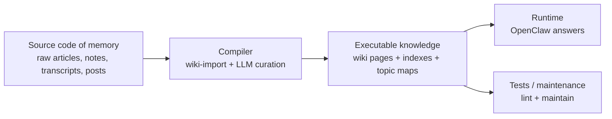
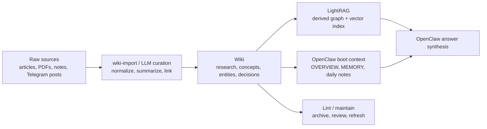
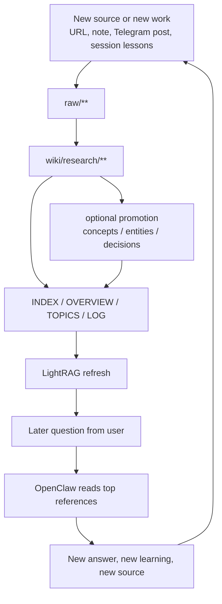
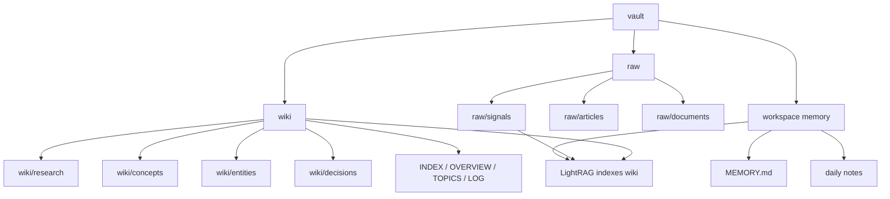
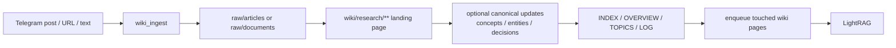
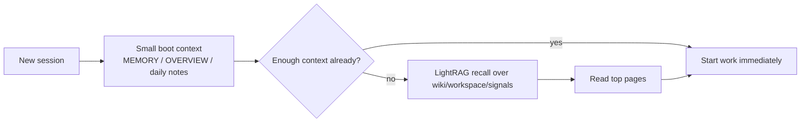
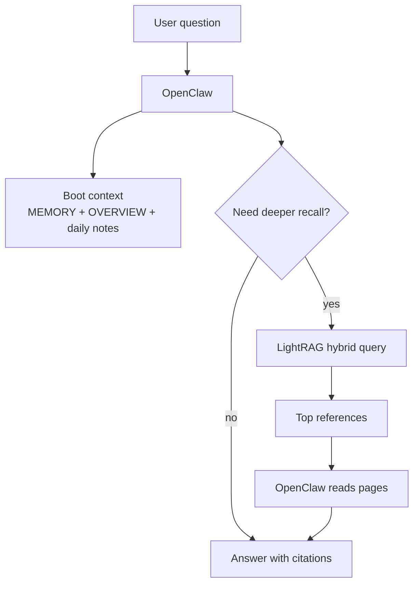

# LLM-Wiki Memory Explained

This page is the shortest human-readable explanation of how memory works in this project.

Recommended next step after this file:
- technical model -> `docs/10-memory-architecture.md`
- save and promotion behavior -> `docs/17-knowledge-management.md`
- runtime answer path -> `docs/15-llm-wiki-query-flow.md`

If you only want one mental model, use this:

```text
raw sources -> curated wiki -> LightRAG index -> OpenClaw answers
```

`wiki/` is the durable knowledge artifact.  
`LightRAG` is the retrieval accelerator on top of it.  
`OpenClaw` is the runtime that decides what to load and how to answer.

Another way to say the same thing:

- `raw/` is the source code of memory
- `wiki/` is the compiled memory
- `LightRAG` is the search engine over that compiled memory
- `OpenClaw` is the runtime that uses it to answer quickly

---

## Why LLMs "Forget"

A chat LLM does not really remember your project across sessions.

Each new session starts with:
- an empty context window;
- maybe one static instruction file like `CLAUDE.md`;
- no durable memory of the last bugs, design choices, or article imports unless those were written somewhere.

That creates three bad effects:

1. The model rescans the same files again and again.
2. You burn time and tokens just to rebuild context.
3. Project knowledge lives in chat history instead of a durable artifact.

One static `CLAUDE.md` helps, but only for rules and a short summary. It does not scale to months of:
- decisions,
- imported articles,
- recurring concepts,
- old mistakes,
- research notes,
- project-specific knowledge.

Karpathy's key idea is to treat knowledge more like code:
- keep the raw source;
- compile it into a readable wiki;
- navigate the wiki instead of re-discovering everything every time.

This is why the method feels so effective in practice:

- a new session no longer starts from zero;
- the model does not need to blindly rescan the same folders;
- old work stops living only inside chat history;
- the project gets an accumulated memory that survives across sessions.

One short rules file such as `CLAUDE.md` is still useful, but it is not enough as the project grows.
It is a sticky note. The wiki is the memory system.

---

## What Karpathy's Idea Really Changes

Karpathy's insight is not "put documents near the model".

It is closer to this:

1. stop treating knowledge as disposable chat context;
2. store raw evidence separately from curated knowledge;
3. let the model compile sources into a navigable markdown wiki;
4. make future sessions start from that compiled memory instead of rediscovering everything.

That is why the compiler analogy is so useful.



If you remember only one thing from this page, remember this:

`raw` is not yet knowledge.  
`wiki` is the usable memory artifact.

After this page, the intended reading path for a human is:

```text
README -> docs/19 -> docs/10 -> docs/17 -> docs/15
```

---

## What Karpathy-Style Memory Means Here

We use the same core pattern, but adapted to this repo and this runtime:



The important part is the order:

1. source lands in `raw/**`
2. `wiki-import` turns it into a visible wiki artifact
3. only then does retrieval index the resulting knowledge

That is why "uploaded to LightRAG" is not proof of storage.  
The proof is a real page in `wiki/`.

---

## The Memory Cycle In Real Life

In everyday use the system works as a loop, not as a one-time import.



So memory is not just "saved files".  
It is a repeating cycle:

- capture;
- compile;
- retrieve;
- answer;
- refine;
- maintain.

---

## The Three Main Layers

### 1. `raw/` — immutable source evidence

This is where source material lands first:

- `raw/articles/**`
- `raw/documents/**`
- `raw/signals/**`

Think of it as:
- source evidence;
- input to curation;
- something you preserve, but do not treat as finished knowledge.

Important:
- `raw/articles/**` and `raw/documents/**` are **not indexed directly** into LightRAG
- `raw/signals/**` is the one exception because it is already compact and useful as a derived signal stream

### 2. `wiki/` — curated, human-readable source of truth

This is the real LLM-Wiki.

It contains:
- `wiki/research/**` — source-centric and synthesis-heavy pages
- `wiki/concepts/**` — durable concepts and patterns
- `wiki/entities/**` — canonical systems, tools, people, services
- `wiki/decisions/**` — explicit decision records

And bot-maintained system files:
- `wiki/INDEX.md`
- `wiki/OVERVIEW.md`
- `wiki/TOPICS.md`
- `wiki/LOG.md`
- `wiki/SCHEMA.md`
- `wiki/CANONICALS.yaml`

This is where knowledge becomes durable and inspectable.

### 3. `LightRAG` — derived retrieval layer

`LightRAG` is not the wiki itself.

It stores derived state:
- chunks
- vectors
- document status
- entities
- relationships

It exists so OpenClaw does **not** need to:
- load the whole vault into context;
- scan dozens of files from scratch every time;
- rediscover the same historical facts again and again.

So the split is:

- `wiki/` = durable knowledge artifact
- `LightRAG` = search engine over that artifact

---

## Why We Do Not Stop At Plain Wiki Navigation

Karpathy's original pattern proves that markdown navigation alone can already work very well.

That is still true here for:
- small knowledge sets;
- obvious concepts;
- direct navigation from `INDEX.md`, `OVERVIEW.md`, and `TOPICS.md`.

But our system is larger and more operational:
- Telegram surfaces create frequent new saves;
- there is historical memory across many topics;
- there are workspace notes, wiki pages, and signal streams;
- users ask recall questions that often touch older or less obvious pages.

That is where `LightRAG` helps.

It lets us:
- search the long tail faster;
- combine graph and semantic retrieval;
- avoid loading too many files into prompt context;
- keep answers grounded in existing wiki pages instead of rediscovering them from scratch.

The right mental model is:

- **without wiki, RAG becomes shallow retrieval over loose text**
- **without retrieval, wiki can become slow to search at larger scale**
- **together, wiki stays authoritative and LightRAG stays fast**

---

## What Goes Where



Use this rule:

- if it is a source, it belongs in `raw/`
- if it is readable accumulated knowledge, it belongs in `wiki/`
- if it is retrieval state, it belongs in `LightRAG`

---

## How Explicit Saves Work

This is the part that matters most for `📚 Knowledgebase` and `💡 Ideas`.



### `Knowledgebase`

`Knowledgebase` means:
- this should become durable system knowledge now

So the bot:
- saves the source into `raw/**`
- creates a visible `wiki/research/**` page
- may update canonical concepts/entities immediately if confidence is high
- then enqueues the resulting wiki pages to LightRAG

### `Ideas`

`Ideas` means:
- capture it now;
- curate deeper later

So the bot still:
- saves the source into `raw/**`
- creates a visible `wiki/research/**` page immediately

But by default it keeps curation lighter:
- fewer canonical updates
- less graph expansion
- promotion later deepens the same artifact chain

Important:
- `Ideas` are **not outside the wiki**
- they already materialize into `wiki/research/**`

---

## What Happens When A New Session Starts

The gain from this design shows up most clearly at session start.

Without durable memory:
- the agent opens cold;
- scans folders again;
- asks repeated questions;
- burns time and tokens to reconstruct yesterday.

With this system:



So the agent does not become magically omniscient.  
It just starts from a much better memory position.

---

## Why `wiki/research/**` Matters So Much

The most important design choice in our system is this:

Every explicit save must create a visible `wiki/research/**` page first.

Why?

Because otherwise the system degenerates into:
- raw dumps,
- hidden retrieval state,
- and no human-readable knowledge artifact.

`wiki/research/**` is the landing layer where:
- the source gets summarized;
- the key takeaways become readable;
- related concepts and entities start to connect;
- the item becomes part of the actual wiki.

Some research pages stay there forever. That is fine.

Not every source deserves promotion into canonical concepts.

---

## Why We Still Need LightRAG

Karpathy's original point is important: for many projects, plain markdown navigation is already enough.

That is still true.

But in our setup, `LightRAG` adds real value because we already have:
- workspace memory,
- wiki pages,
- signal digests,
- historical notes,
- Telegram-driven question answering.

So `LightRAG` helps with the long tail:

1. **Historical recall**
   - "Why did we choose X?"
   - "What do we know about Y?"

2. **Cross-file retrieval**
   - find related wiki pages without manually scanning many folders

3. **Hybrid search**
   - vector similarity + graph traversal

4. **Token efficiency**
   - retrieve the top relevant pages instead of reading everything

The key is to keep it in the right role:

- helpful retrieval engine: yes
- primary memory store: no
- proof that something was saved: no

---

## How OpenClaw Uses Memory



OpenClaw does not blindly stuff the whole vault into the prompt.

It uses:
- small boot context for fast cold start;
- LightRAG when deeper recall is needed;
- direct page reading for the final synthesis.

This is why the system can respond faster while still keeping a durable memory trail.

---

## Why This Saves Tokens and Time

Without a wiki-first memory system:
- each session starts close to zero;
- the model rescans files;
- you re-explain the same context;
- historical knowledge stays trapped in chat logs.

With our setup:
- boot starts from compact memory files plus `wiki/OVERVIEW.md`
- explicit saves already exist as wiki artifacts
- retrieval can fetch only what matters
- the agent spends less time rediscovering and more time reasoning

So the gain is not just "RAG search".

The gain is:
- durable accumulated knowledge
- smaller repeated context cost
- faster warm-up for future sessions

The practical effect is what people usually feel first:

- less repeated scanning;
- fewer "remind me how this works" loops;
- faster cold starts;
- more time spent on real work instead of rebuilding memory.

---

## What To Remember

If you forget everything else, keep these five rules:

1. `raw/` stores source evidence.
2. `wiki/` is the durable source of truth.
3. `wiki/research/**` is the mandatory landing page for explicit saves.
4. `LightRAG` is a derived retrieval layer, not the wiki itself.
5. OpenClaw answers from a mix of boot context, wiki pages, and retrieval — not from chat memory alone.

See also:
- [10-memory-architecture.md](10-memory-architecture.md)
- [15-llm-wiki-query-flow.md](15-llm-wiki-query-flow.md)
- [17-knowledge-management.md](17-knowledge-management.md)
- [20-llm-project-orientation.md](20-llm-project-orientation.md)
