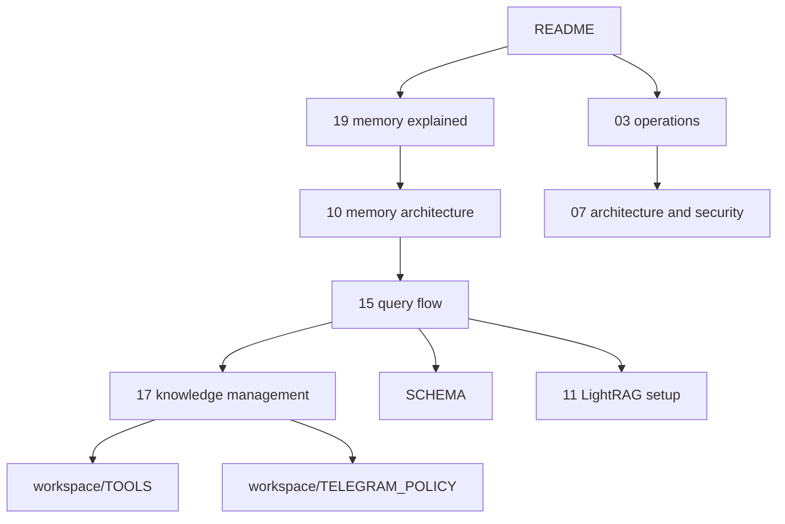

# LLM Project Orientation

This page is for another LLM or coding agent that needs to understand this repo quickly.

Use it as a project map, not as a runtime instruction file.

If you are trying to answer:
- "What is this repo?"
- "Which docs are canonical?"
- "What should I read first for a memory task?"
- "Where is the truth about LightRAG vs wiki?"

start here.

If you are a fresh model entering this repo, the main job of this page is simple:

- help you build the right mental model first;
- stop you from reading the wrong docs too early;
- show you where the actual truth lives for memory, Telegram flows, LightRAG, and ops.

---

## What This Repo Is

This repository is:
- the git-safe operations package for an OpenClaw deployment;
- a documentation hub for server, memory, Telegram surfaces, and bridges;
- the tracked source for supporting services like `wiki-import`, `signals-bridge`, `telethon-digest`, and email bridges.

This repository is **not**:
- the live OpenClaw source tree;
- the running server state itself;
- a full mirror of `/opt/openclaw`;
- the only source of truth for current live state.

Current live state must still be checked on the server when the question is operational.

---

## Core Mental Model

For memory-related tasks, the most important truth is:

```text
raw sources -> curated wiki -> LightRAG index -> OpenClaw answers
```

Interpretation:
- `wiki/` is canonical durable knowledge
- `LightRAG` is a derived retrieval layer
- `raw/articles/**` and `raw/documents/**` are stored but not indexed directly
- explicit save is successful only when a visible wiki page exists

Do not invert that model.

This matters because a lot of bad reasoning starts with the wrong assumption:

- "LightRAG is the database" -> wrong
- "raw sources are already searchable memory" -> wrong
- "Ideas are outside wiki until promotion" -> wrong
- "chat history is enough to reconstruct project state" -> wrong

If you keep the pipeline in the right order, the rest of the docs become much easier to interpret.

---

## How To Learn This Repo Without Drowning

Use a three-pass approach instead of scanning everything at once.

### Pass 1 — build the memory model

Read:
1. [README.md](../README.md)
2. [docs/19-llm-wiki-memory-explained.md](19-llm-wiki-memory-explained.md)
3. [docs/10-memory-architecture.md](10-memory-architecture.md)

Goal:
- understand `raw -> wiki -> LightRAG -> OpenClaw`
- understand what counts as durable memory
- understand why `wiki/research/**` is the landing layer

### Pass 2 — understand runtime behavior

Read:
1. [docs/15-llm-wiki-query-flow.md](15-llm-wiki-query-flow.md)
2. [docs/17-knowledge-management.md](17-knowledge-management.md)
3. [workspace/TOOLS.md](../workspace/TOOLS.md)
4. [workspace/TELEGRAM_POLICY.md](../workspace/TELEGRAM_POLICY.md)

Goal:
- understand how saves, search, and retrieval actually happen
- understand the `Knowledgebase` / `Ideas` contract
- understand what the agent is allowed to do

### Pass 3 — go task-specific

Only then branch into:
- server operations
- bridge jobs
- Telegram routing
- LightRAG setup
- service implementation details

That is usually faster and more accurate than trying to read the whole repo front to back.

---

## Read Order by Default

If you know nothing about the repo, read in this order:

1. [README.md](../README.md)
2. [docs/19-llm-wiki-memory-explained.md](19-llm-wiki-memory-explained.md)
3. [docs/10-memory-architecture.md](10-memory-architecture.md)
4. [docs/15-llm-wiki-query-flow.md](15-llm-wiki-query-flow.md)
5. [docs/17-knowledge-management.md](17-knowledge-management.md)
6. [workspace/TOOLS.md](../workspace/TOOLS.md)
7. [workspace/TELEGRAM_POLICY.md](../workspace/TELEGRAM_POLICY.md)

That path gives:
- repo context
- intuitive memory model
- technical memory model
- query/runtime flow
- Telegram save/search semantics
- tool contract

If you are extremely context-constrained, stop after steps `1-4` and only continue when the task really needs it.

---

## Canonical Docs by Topic

### If the task is about memory / LLM-Wiki

Read:
1. [docs/19-llm-wiki-memory-explained.md](19-llm-wiki-memory-explained.md)
2. [docs/10-memory-architecture.md](10-memory-architecture.md)
3. [docs/15-llm-wiki-query-flow.md](15-llm-wiki-query-flow.md)
4. [docs/17-knowledge-management.md](17-knowledge-management.md)
5. [artifacts/llm-wiki/SCHEMA.md](../artifacts/llm-wiki/SCHEMA.md)

Key takeaway you should hold while reading:
- `research/**` is a valid final state
- canonical promotion is selective
- lifecycle metadata is additive over the wiki-first model

### If the task is about LightRAG

Read:
1. [docs/11-lightrag-setup.md](11-lightrag-setup.md)
2. [docs/15-llm-wiki-query-flow.md](15-llm-wiki-query-flow.md)
3. [docs/10-memory-architecture.md](10-memory-architecture.md)

Key takeaway:
- LightRAG is a retrieval accelerator over curated markdown knowledge, not a substitute for that knowledge

### If the task is about Telegram surfaces / routing

Read:
1. [docs/12-telegram-channel-architecture.md](12-telegram-channel-architecture.md)
2. [workspace/TELEGRAM_POLICY.md](../workspace/TELEGRAM_POLICY.md)
3. [docs/17-knowledge-management.md](17-knowledge-management.md)

Key takeaway:
- explicit user saves must materialize into wiki pages
- passive digests and explicit saves are different storage classes

### If the task is about server operations / deploy

Read:
1. [docs/01-server-state.md](01-server-state.md)
2. [docs/03-operations.md](03-operations.md)
3. [docs/07-architecture-and-security.md](07-architecture-and-security.md)
4. [docs/11-lightrag-setup.md](11-lightrag-setup.md)

### If the task is about runtime behavior of Бенька

Read:
1. [workspace/AGENTS.md](../workspace/AGENTS.md)
2. [workspace/TOOLS.md](../workspace/TOOLS.md)
3. [workspace/INDEX.md](../workspace/INDEX.md)
4. [workspace/BOOT.md](../workspace/BOOT.md)

---

## Trust Hierarchy

Use this hierarchy when facts conflict:

```text
LIVE > RAW > DERIVED
```

Meaning:
- live state questions -> check Docker, health endpoints, logs, current config
- historical reasoning -> raw / wiki / retrieval
- quick summaries and boot files are useful, but not authoritative for current runtime state

For wiki-related knowledge specifically:

```text
wiki source of truth > LightRAG retrieval snippets > chat assumptions
```

Do not treat retrieval output alone as authoritative.
Open the referenced pages when accuracy matters.

Also use this doc-reading rule:

```text
newer memory/wiki docs > older wording in scattered docs > assumptions from old chats
```

---

## What Is Already Implemented

This is important so you do not plan against an imaginary older architecture.

Already implemented:
- explicit saves materialize into `wiki/research/**`
- `Ideas` also write to wiki immediately, but with light curation
- `Knowledgebase` is wiki-first, not LightRAG-first
- `wiki-import` is the single writer for bot-owned wiki artifacts
- `LightRAG` indexes:
  - `workspace/**`
  - `wiki/**`
  - `raw/signals/**`
- `raw/articles/**` and `raw/documents/**` are stored but not indexed directly
- historical Knowledgebase backfill exists and replays old posts into wiki
- canonical concepts/entities are already partially enforced via `CANONICALS.yaml`

If you see older wording elsewhere, prefer the newer memory/query docs over stale assumptions.

---

## What A New LLM Should Internalize In The First 10 Minutes

Before touching code, you should be able to say all of this back correctly:

1. `wiki/` is the durable knowledge layer.
2. `LightRAG` indexes `wiki/**`, `workspace/**`, and `raw/signals/**`.
3. `raw/articles/**` and `raw/documents/**` are preserved inputs, not directly indexed memory.
4. Explicit saves from `Knowledgebase` and `Ideas` both create `wiki/research/**`.
5. `Ideas` differ by lighter curation, not by living outside the wiki.
6. A save is not successful just because something was uploaded to retrieval.
7. Runtime/ops questions may still require checking the live server.

If you cannot restate those seven points, you are not ready to reason safely about this repo yet.

---

## What Not To Assume

Do not assume any of the following:

1. `LightRAG` is the wiki database.
   It is not.

2. `Ideas` are outside wiki until promotion.
   Not true anymore.

3. Saving a source into `raw/articles/**` means it is available for search.
   Not by default.

4. A successful `documents/upload` means knowledge is saved.
   No. A visible wiki page is the proof.

5. `workspace/AGENTS.md` is the best overview of the whole repo.
   It is mainly a runtime instruction file for Бенька.

6. All docs are equally current.
   They are not. Prefer the docs listed in this orientation page for active architecture.

---

## Fast Paths by Task

### Task: "Understand memory quickly"

Read:
- [docs/19-llm-wiki-memory-explained.md](19-llm-wiki-memory-explained.md)
- [docs/10-memory-architecture.md](10-memory-architecture.md)

### Task: "How does query answer generation work?"

Read:
- [docs/15-llm-wiki-query-flow.md](15-llm-wiki-query-flow.md)

### Task: "How do Telegram saves/promotions work?"

Read:
- [docs/17-knowledge-management.md](17-knowledge-management.md)
- [workspace/TELEGRAM_POLICY.md](../workspace/TELEGRAM_POLICY.md)

### Task: "How do I modify wiki-import?"

Read:
- [artifacts/llm-wiki/SCHEMA.md](../artifacts/llm-wiki/SCHEMA.md)
- [workspace/TOOLS.md](../workspace/TOOLS.md)
- [docs/15-llm-wiki-query-flow.md](15-llm-wiki-query-flow.md)
- then inspect `artifacts/wiki-import/`

When reading code in `artifacts/wiki-import/`, expect these responsibilities:
- `importer.py` = memory compilation logic
- `service.py` = HTTP surface
- tests = behavior contract

### Task: "What should I check before server changes?"

Read:
- [docs/01-server-state.md](01-server-state.md)
- [docs/03-operations.md](03-operations.md)
- [docs/07-architecture-and-security.md](07-architecture-and-security.md)

---

## Common Pitfalls for LLMs Reading This Repo

1. Reading too much too early.
   Start from the docs map above; do not scan the entire repo blindly.

2. Mixing design intent with live system state.
   If the question is operational, verify on the server.

3. Treating `LightRAG` as the source of truth.
   It is derived retrieval state.

4. Missing the wiki-first save contract.
   Interactive saves must create `wiki/research/**` first.

5. Assuming old docs win.
   Prefer the newer memory/wiki docs unless the question is historical.

6. Ignoring audience split.
   Some docs are for humans, some for runtime behavior, some for ops.

7. Jumping into code before understanding the document graph.
   In this repo, docs are part of the architecture, not just commentary.

8. Treating old plan files as current implementation truth.
   Planning docs are useful context, but runtime docs and current code win.

---

## Minimum Context for a New LLM

If context is tight, the minimum safe set is:

1. [README.md](../README.md)
2. [docs/19-llm-wiki-memory-explained.md](19-llm-wiki-memory-explained.md)
3. [docs/15-llm-wiki-query-flow.md](15-llm-wiki-query-flow.md)
4. [workspace/TOOLS.md](../workspace/TOOLS.md)

That is usually enough to avoid the worst architectural mistakes.

See also:
- [workspace/AGENTS.md](../workspace/AGENTS.md)
- [workspace/INDEX.md](../workspace/INDEX.md)

---

## One-Page Docs Graph

Use this as the compact map of the current documentation set.



Read the graph from left to right:
- start with repo context
- then learn the memory model
- then learn runtime/query behavior
- then branch into tooling, schema, or operations depending on task
